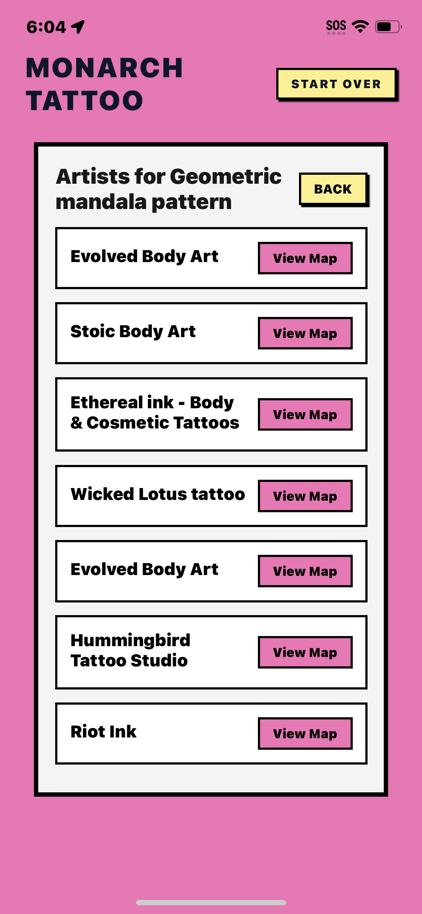

# Monarch Tattoo

An experimental React Native mobile app that uses Google's Gemini API to visualize tattoo designs on your body and discover local artists using Maps Grounding.

## Overview

Monarch Tattoo is a side project exploring Gemini's multimodal AI capabilities and Maps Grounding API. Upload a photo of a body part, get personalized style recommendations, generate realistic tattoo previews, and find nearby artists who specialize in your chosen style.

## Features

- 📸 **Image Upload**: Take photos or select from gallery
- 🤖 **AI Style Recommendations**: Get personalized suggestions based on body part analysis
- 🎨 **Tattoo Preview Generation**: Generate realistic previews using Gemini's image generation
- ✏️ **Custom Designs**: Describe your own ideas or upload reference images
- 📍 **Artist Discovery**: Find nearby tattoo shops using Google Maps Grounding API
- 🗺️ **Interactive Maps**: View artist locations on an in-app map (requires development build)

## Screenshots

<div align="center">
  
  
  
  
</div>

## Tech Stack

- **Framework**: React Native with Expo SDK 54
- **Language**: TypeScript
- **AI**: Google Gemini API (`@google/genai`)
  - Multimodal content generation
  - Maps Grounding for location-based search
- **Maps**: Expo Maps (requires development build for native maps)
- **UI**: React Native components with Lucide icons
- **State Management**: React hooks

## Prerequisites

- Node.js 20.19.4 or higher
- npm or yarn
- Expo Go app (for testing on physical devices)
- Google Gemini API key ([Get one here](https://aistudio.google.com/app/apikey))

## Installation

1. **Clone the repository**

```bash
git clone https://github.com/bantoinese83/Monarch-Tattoo.git
cd Monarch-Tattoo
```

2. **Install dependencies**

```bash
npm install
```

3. **Set up environment variables**

Create a `.env` file in the root directory:

```bash
EXPO_PUBLIC_API_KEY=your_google_genai_api_key_here
```

**Note**: Expo automatically exposes `EXPO_PUBLIC_*` environment variables. Make sure your `.env` file is in `.gitignore` (it should be by default).

4. **Start the development server**

```bash
npm start
```

Or use Expo CLI directly:

```bash
npx expo start
```

## Running the App

### Development

- **iOS Simulator**: Press `i` in the terminal
- **Android Emulator**: Press `a` in the terminal
- **Physical Device**: Scan the QR code with Expo Go app

### Development Build (for native maps)

To use the in-app map feature, you'll need to create a development build:

```bash
# iOS
npx expo run:ios

# Android
npx expo run:android
```

**Note**: The map view gracefully falls back to a list view in Expo Go when native modules aren't available.

## Project Structure

```
monarch-tattoo/
├── App.tsx                    # Main app component and state management
├── index.js                   # Expo entry point
├── app.json                   # Expo configuration
├── babel.config.js           # Babel configuration
├── tsconfig.json             # TypeScript configuration
├── tsconfig.strict.json      # Strict TypeScript config
├── assets/                    # App icons, splash screens
├── components/                # React Native components
│   ├── ArtistFinder.tsx      # Artist list and map view
│   ├── CustomInput.tsx       # Custom tattoo idea input
│   ├── EditControls.tsx      # Tattoo editing controls
│   ├── ErrorDisplay.tsx      # Error handling UI
│   ├── Header.tsx            # App header
│   ├── Icon.tsx              # Icon component wrapper
│   ├── ImagePreview.tsx      # Tattoo preview display
│   ├── ImageUploader.tsx     # Image upload interface
│   ├── LoadingSpinner.tsx    # Loading states
│   └── RecommendationList.tsx # Style recommendations
├── services/
│   └── geminiService.ts      # Gemini API integration
│       ├── getTattooIdeas()  # Style recommendations
│       ├── generateTattoo()  # Generate preview
│       ├── editTattoo()      # Edit existing design
│       └── findTattooArtists() # Maps Grounding search
├── types.ts                   # TypeScript type definitions
└── utils/
    ├── debounce.ts           # Debounce utility
    ├── fileUtils.ts          # Image picker helpers
    ├── haptics.ts            # Haptic feedback
    └── networkUtils.ts       # Error handling utilities
```

## API Integration

### Gemini API

The app uses Gemini's multimodal capabilities for:

- **Image Analysis**: Analyzing body part images to suggest styles
- **Image Generation**: Creating realistic tattoo previews (`gemini-2.5-flash-image`)
- **Text Generation**: Style recommendations (`gemini-2.5-flash`)

### Maps Grounding API

The artist finder uses Gemini's Maps Grounding feature:

- Natural language queries (e.g., "tattoo shops near me specializing in neo-traditional")
- Location-aware search using user's coordinates
- Returns structured data: names, ratings, reviews, place IDs, and Maps links

**Example Query**:

```typescript
'Find tattoo shops and tattoo parlors near me that specialize in ${style} style tattoos';
```

## Development Scripts

```bash
# Start development server
npm start

# Type checking
npm run type-check

# Linting
npm run lint
npm run lint:fix

# Formatting
npm run format
npm run format:check

# Run all checks
npm run check

# Build for production
npm run build

# Clean build artifacts
npm run clean
```

## Permissions

The app requires the following permissions (configured in `app.json`):

- **Camera**: For taking photos of body parts
- **Photo Library**: For selecting images from gallery
- **Location**: For finding nearby artists (foreground only)

Permissions are requested at runtime with clear explanations.

## Known Limitations

- **Maps in Expo Go**: Native map view requires a development build. The app gracefully falls back to list view.
- **Coordinate Extraction**: Maps Grounding responses don't always include coordinates in URIs. The app attempts to parse them but may fall back to list view.
- **API Rate Limits**: Subject to Gemini API rate limits. Free tier includes 500 Maps Grounding requests per day.

## Troubleshooting

### "Cannot find native module 'ExpoMaps'"

This is expected in Expo Go. The map feature requires a development build. The app will automatically show the list view instead.

### "No response from API"

- Check that your `EXPO_PUBLIC_API_KEY` is set correctly
- Verify your API key has access to Gemini API
- Check network connectivity
- Review console logs for detailed error messages

### Maps Grounding returns no results

- Ensure location permissions are granted
- Try a more general query (e.g., "tattoo shops" instead of specific style)
- Check that you're using a supported model (Gemini 2.5 Flash or newer)

## Contributing

This is an experimental side project, but suggestions and improvements are welcome! Feel free to open issues or submit pull requests.

## License

This project is private and experimental.

## Acknowledgments

- Built with [Expo](https://expo.dev/)
- AI powered by [Google Gemini](https://ai.google.dev/)
- Maps integration via [Google Maps Grounding](https://ai.google.dev/docs/maps_grounding)

---

**Note**: This is an experimental project for testing Gemini's Maps Grounding API. Not intended for production use.
